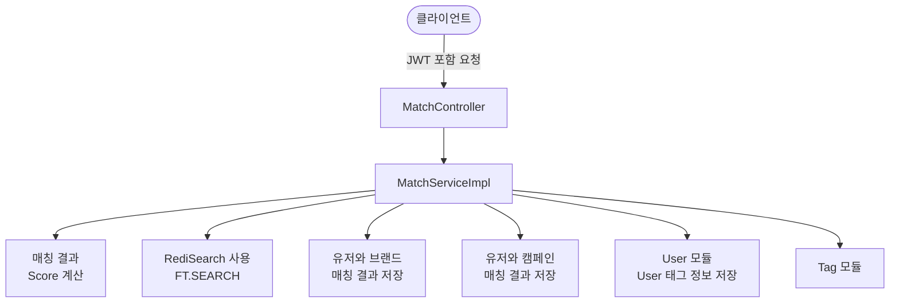
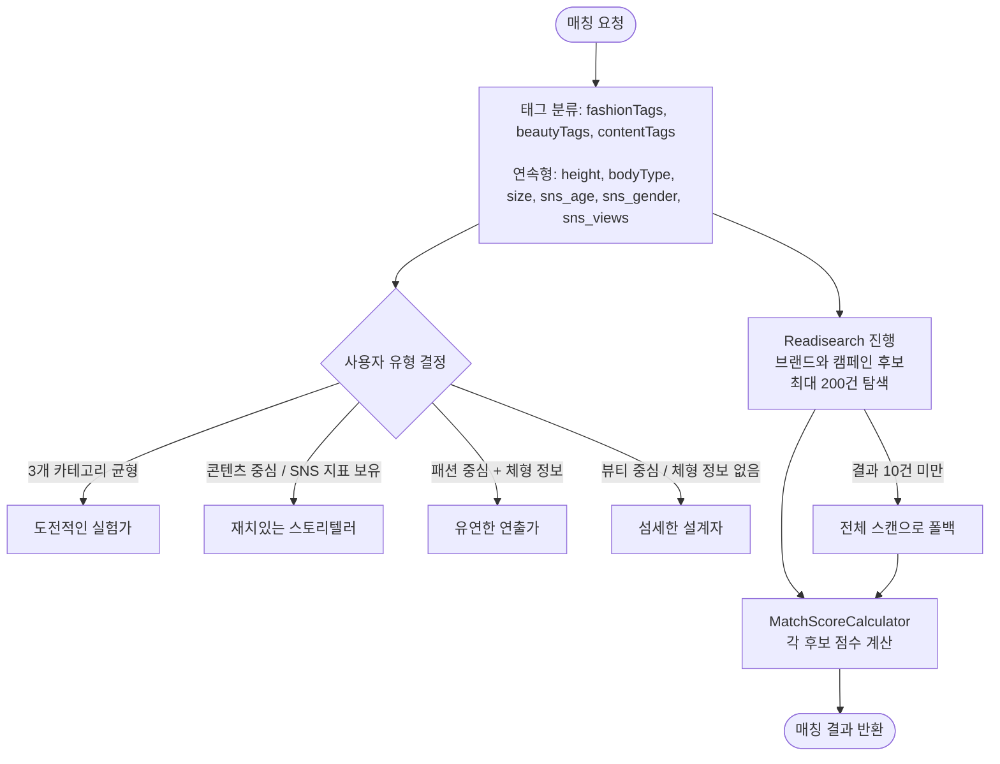
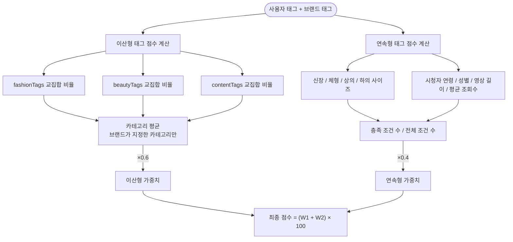
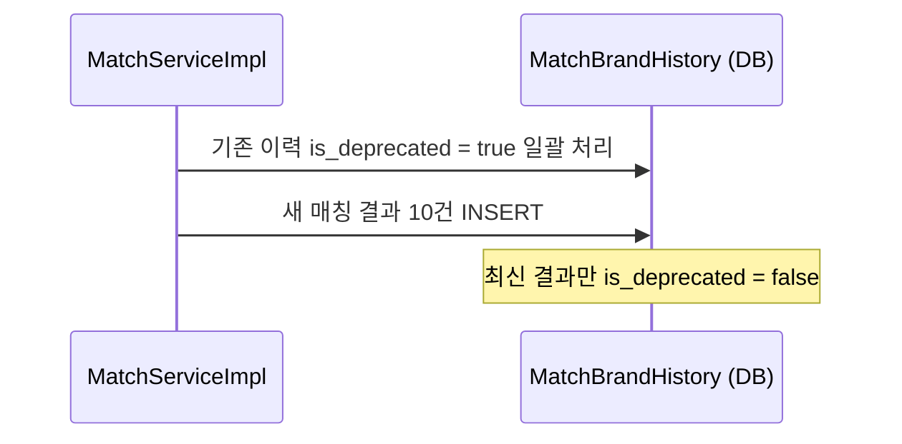
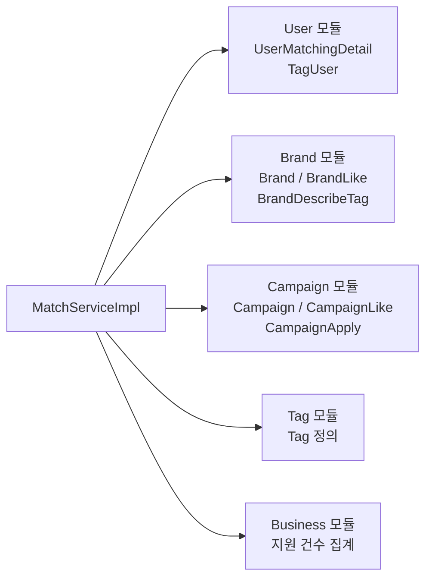
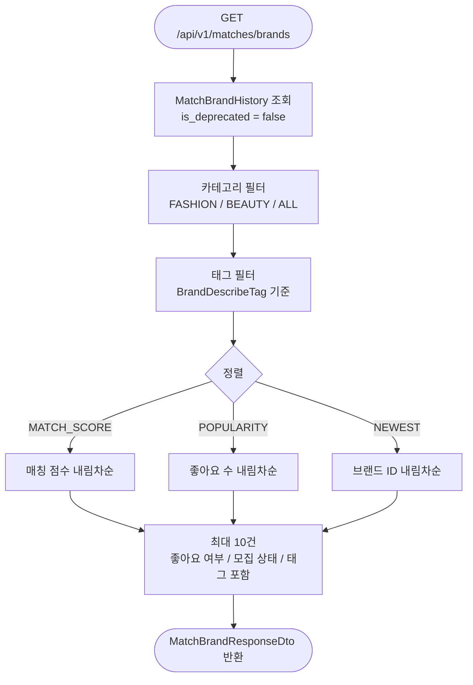
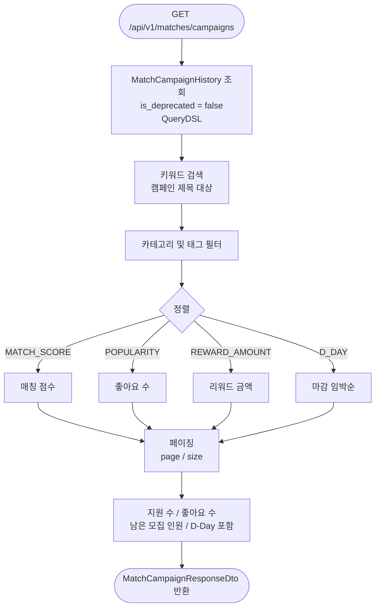

# Match 알고리즘 구조 및 연결 흐름

## 1. 개요

Match 모듈은 크리에이터(인플루언서)와 브랜드/캠페인을 태그 기반으로 매칭하는 핵심 알고리즘입니다.
사용자가 입력한 뷰티/패션/콘텐츠 태그를 바탕으로 유형을 분석하고, Redis Search로 후보를 탐색한 뒤 점수를 계산해 상위 결과를 반환합니다.

---

## 2. 패키지 구조

```
match/
├── presentation/
│   ├── controller/MatchController.java        # REST API 엔드포인트
│   ├── dto/request/MatchRequestDto.java       # 매칭 요청 DTO
│   ├── dto/response/MatchResponseDto.java     # 매칭 분석 결과 DTO
│   ├── dto/response/MatchBrandResponseDto.java
│   ├── dto/response/MatchCampaignResponseDto.java
│   └── swagger/MatchSwagger.java             # Swagger 문서
├── application/
│   ├── service/MatchService.java             # 서비스 인터페이스
│   ├── service/MatchServiceImpl.java         # 매칭 알고리즘 구현체
│   └── util/MatchScoreCalculator.java        # 점수 계산 유틸
├── domain/
│   ├── entity/MatchBrandHistory.java         # 브랜드 매칭 이력 엔티티
│   ├── entity/MatchCampaignHistory.java      # 캠페인 매칭 이력 엔티티
│   ├── entity/enums/BrandSortType.java       # 브랜드 정렬 옵션
│   ├── entity/enums/CampaignSortType.java    # 캠페인 정렬 옵션
│   ├── entity/enums/CategoryType.java        # 카테고리 필터 (FASHION, BEAUTY, ALL)
│   ├── entity/enums/TagType.java             # 태그 유형
│   ├── repository/MatchBrandHistoryRepository.java
│   ├── repository/MatchBrandHistoryRepositoryCustom.java
│   ├── repository/MatchBrandHistoryRepositoryCustomImpl.java  # QueryDSL 구현
│   ├── repository/MatchCampaignHistoryRepository.java
│   ├── repository/MatchCampaignHistoryRepositoryCustom.java
│   └── repository/MatchCampaignHistoryRepositoryCustomImpl.java
└── infrastructure/
    └── redis/
        ├── document/UserTagDocument.java      # 사용자 태그 Redis 문서
        ├── document/BrandTagDocument.java     # 브랜드 태그 Redis 문서
        ├── document/CampaignTagDocument.java  # 캠페인 태그 Redis 문서
        ├── repository/UserTagRedisRepository.java
        ├── repository/BrandTagRedisRepository.java
        ├── repository/CampaignTagRedisRepository.java
        └── RedisDocumentHelper.java           # FT.SEARCH 쿼리 빌더
```

---

## 3. API 엔드포인트

| Method | 경로 | 설명 |
|--------|------|------|
| `POST` | `/api/v1/matches` | 태그 입력 → 유형 분석 + 매칭 결과 저장 |
| `GET` | `/api/v1/matches/brands` | 저장된 매칭 브랜드 목록 조회 |
| `GET` | `/api/v1/matches/campaigns` | 저장된 매칭 캠페인 목록 조회 (검색/정렬/페이징) |

---

## 4. 전체 호출 흐름



---

## 5. POST /api/v1/matches — 매칭 분석 상세 흐름

### 5-1. 요청 입력 (`MatchRequestDto`)

| 섹션 | 주요 필드 |
|------|----------|
| 뷰티 | interestStyleTags, preferredFunctionTags, skinTypeTags, skinToneTags, makeupStyleTags |
| 패션 | interestStyleTags, preferredItemTags, heightTag, weightTypeTag, topSizeTag, bottomSizeTag |
| 콘텐츠 | sns(url, mainAudience, averageAudience), typeTags, categoryTags, toneTags, preferredInvolvementTags |

### 5-2. 처리 단계



### 5-3. 응답 (`MatchResponseDto`)

```json
{
  "username": "닉네임",
  "userType": "도전적인 실험가",
  "userTypeImage": "아바타 이미지 URL",
  "typeTag": ["연출 유연", "트렌드 적용", "브랜드 이해도"],
  "userTypeTag": ["콘셉트실험", "포맷도전", "새로움 추구"],
  "highMatchingBrandList": {
    "count": 10,
    "brands": [
      { "brandId": 1, "brandName": "브랜드명", "logoUrl": "...", "matchingRatio": 85 }
    ]
  }
}
```

---

## 6. 매칭 점수 계산 (`MatchScoreCalculator`)

### 공식

```
최종 점수 = (이산형 태그 점수 × 0.6 + 연속형 태그 점수 × 0.4) × 100
```

### 점수 계산 흐름



### 점수 예시

| 상황 | 이산형 | 연속형 | 최종 점수 |
|------|--------|--------|-----------|
| 태그/체형 모두 일치 | 1.0 | 1.0 | 100 |
| 태그 60% 일치, 체형 없음 | 0.6 | 1.0 | 76 |
| 태그 없음, 체형 50% | 1.0 | 0.5 | 80 |

---

## 7. Redis 검색 인프라 (`RedisDocumentHelper`)

```mermaid
flowchart LR
    Tags[사용자 태그 Set] --> Q[FT.SEARCH 쿼리 생성\n@preferredFashionTags:{5|6|7}\n| @preferredBeautyTags:{10|11}]
    Q --> Idx[(Redis Index\nBrandTagDocumentIdx\nCampaignTagDocumentIdx)]
    Idx -->|최대 200건| R{결과 수 >= 10?}
    R -->|Yes| Candidates[후보 목록 반환]
    R -->|No| Fallback[전체 스캔 쿼리 * 로 재탐색]
    Fallback --> Candidates
```

---

## 8. 매칭 이력 저장 패턴



### MatchBrandHistory / MatchCampaignHistory 컬럼

| 컬럼 | 설명 |
|------|------|
| id | PK |
| user_id | 사용자 FK |
| brand_id / campaign_id | 매칭된 대상 FK |
| matching_ratio | 매칭 점수 (0~100) |
| is_deprecated | 최신 결과 여부 (false = 현재 유효) |

---

## 9. 외부 모듈 의존성



---

## 10. GET /api/v1/matches/brands — 브랜드 목록 조회



---

## 11. GET /api/v1/matches/campaigns — 캠페인 목록 조회


